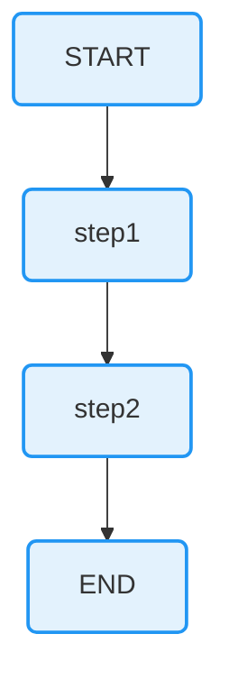
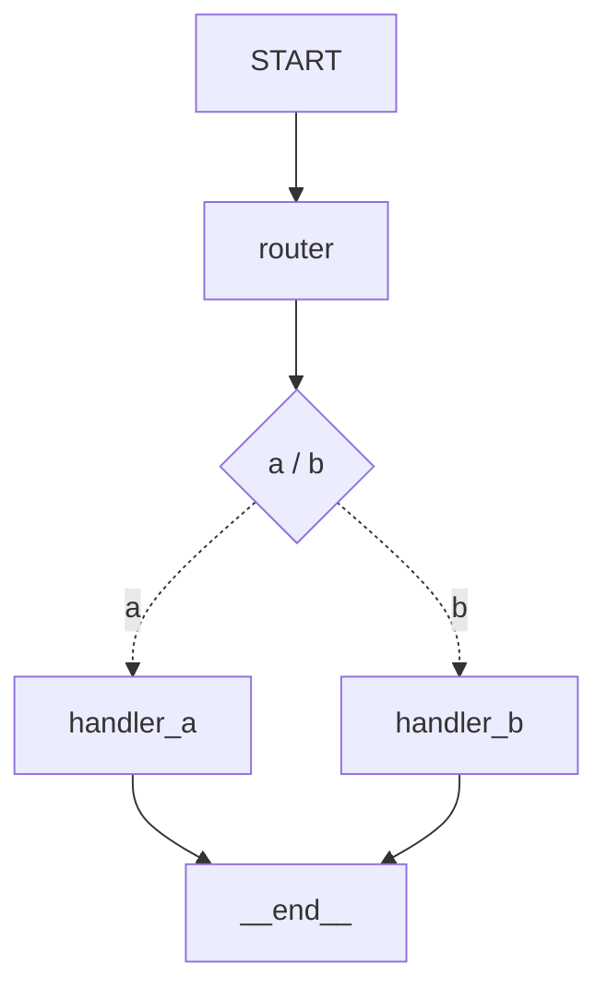

# GraphAgent

[](https://badge.fury.io/rb/graph-agent) [](https://github.com/ai-firstly/graph-agent/actions/workflows/ci.yml) [](https://www.ruby-lang.org/) [](LICENSE)

A Ruby framework for building stateful, multi-actor agent workflows. Ruby port of [LangGraph](https://github.com/langchain-ai/langgraph).

GraphAgent provides low-level infrastructure for building agents that can persist through failures, support human-in-the-loop workflows, and maintain comprehensive memory across sessions.

## Installation

Add this line to your application's Gemfile:

```ruby
gem 'graph-agent'
```

And then execute:

```bash
bundle install
```

## Quick Start

```ruby
require "graph_agent"

# Define your state schema with reducers
schema = GraphAgent::State::Schema.new do
  field :messages, type: Array, reducer: ->(a, b) { a + b }, default: []
end

# Create a graph
graph = GraphAgent::Graph::StateGraph.new(schema)

# Add nodes (functions that process state)
graph.add_node("greet") do |state|
  { messages: [{ role: "ai", content: "Hello! How can I help you?" }] }
end

# Define edges
graph.add_edge(GraphAgent::START, "greet")
graph.add_edge("greet", GraphAgent::END_NODE)

# Compile and run
app = graph.compile
result = app.invoke({ messages: [{ role: "user", content: "Hi!" }] })
puts result[:messages]
```

## Core Concepts

### State

State is the shared data structure that represents the current snapshot of your application. Define it using a Schema with fields and optional reducers:

```ruby
schema = GraphAgent::State::Schema.new do
  field :messages, type: Array, reducer: GraphAgent::Reducers::ADD, default: []
  field :count, type: Integer, reducer: GraphAgent::Reducers::ADD, default: 0
  field :last_input, type: String  # No reducer = last-value semantics
end
```

You can also use a Hash-based schema:

```ruby
graph = GraphAgent::Graph::StateGraph.new({
  messages: { type: Array, reducer: ->(a, b) { a + b }, default: [] },
  count: { type: Integer, reducer: ->(a, b) { a + b }, default: 0 },
  status: {}  # last-value semantics
})
```

#### Built-in Reducers

| Reducer | Description |
|---------|-------------|
| `Reducers::ADD` | Adds/concatenates values (`a + b`) |
| `Reducers::APPEND` | Appends to array (`Array(a) + Array(b)`) |
| `Reducers::MERGE` | Merges hashes (`a.merge(b)`) |
| `Reducers::REPLACE` | Always replaces (`b`) |
| `Reducers.add_messages` | Smart message merging by ID |

### Nodes

Nodes are functions that process the current state and return updates. They receive the state as input and return a Hash of updates:

```ruby
graph.add_node("process") do |state|
  { count: 1, status: "processed" }
end

# Or with config access:
graph.add_node("process") do |state, config|
  thread_id = config.dig(:configurable, :thread_id)
  { count: 1 }
end

# Using a method:
def my_processor(state)
  { count: state[:count] + 1 }
end
graph.add_node("process", method(:my_processor))
```

### Edges

Edges define how the graph transitions between nodes:

```ruby
# Normal edge: always go from A to B
graph.add_edge("node_a", "node_b")

# Entry point: where to start
graph.add_edge(GraphAgent::START, "first_node")
# or
graph.set_entry_point("first_node")

# Exit point: where to finish
graph.add_edge("last_node", GraphAgent::END_NODE)
# or
graph.set_finish_point("last_node")

# Conditional edge: route based on state
graph.add_conditional_edges(
  "classifier",
  ->(state) { state[:urgency] == "high" ? "escalate" : "auto_reply" }
)

# With path map:
graph.add_conditional_edges(
  "classifier",
  ->(state) { state[:category] },
  { "billing" => "billing_handler", "tech" => "tech_handler", "other" => "general_handler" }
)
```

### Conditional Edges

Conditional edges allow dynamic routing based on state:

```ruby
should_continue = ->(state) do
  last_message = state[:messages].last
  if last_message[:tool_calls]&.any?
    "tool_node"
  else
    GraphAgent::END_NODE.to_s
  end
end

graph.add_conditional_edges("llm_call", should_continue)
```

### Send (Map-Reduce Pattern)

Use `Send` to dynamically create parallel tasks:

```ruby
continue_to_jokes = ->(state) do
  state[:subjects].map do |subject|
    GraphAgent::Send.new("generate_joke", { subject: subject })
  end
end

graph.add_conditional_edges("get_subjects", continue_to_jokes)
```

### Command (Dynamic Routing + State Updates)

Use `Command` to combine state updates with routing decisions:

```ruby
graph.add_node("router") do |state|
  GraphAgent::Command.new(
    update: { routed: true },
    goto: "target_node"
  )
end
```

## Compilation & Execution

### Compile

```ruby
# Basic compilation
app = graph.compile

# With checkpointer for persistence
checkpointer = GraphAgent::Checkpoint::InMemorySaver.new
app = graph.compile(checkpointer: checkpointer)

# With interrupts for human-in-the-loop
app = graph.compile(
  checkpointer: checkpointer,
  interrupt_before: ["human_review"],
  interrupt_after: ["draft"]
)
```

### Invoke

```ruby
result = app.invoke(
  { messages: [{ role: "user", content: "Hello" }] },
  config: { configurable: { thread_id: "thread-1" } },
  recursion_limit: 50
)
```

### Stream

```ruby
# Stream state values after each step
app.stream(input, stream_mode: :values) do |state|
  puts "State: #{state}"
end

# Stream per-node updates
app.stream(input, stream_mode: :updates) do |updates|
  puts "Updates: #{updates}"
end

# Using Enumerator
events = app.stream(input, stream_mode: :values)
events.each { |state| puts state }
```

## Persistence & Checkpointing

### InMemorySaver

```ruby
checkpointer = GraphAgent::Checkpoint::InMemorySaver.new
app = graph.compile(checkpointer: checkpointer)

config = { configurable: { thread_id: "user-123" } }

# First invocation
result1 = app.invoke({ messages: [{ role: "user", content: "Hi" }] }, config: config)

# Second invocation continues from checkpoint
result2 = app.invoke({ messages: [{ role: "user", content: "What did I say?" }] }, config: config)

# Inspect state
snapshot = app.get_state(config)
puts snapshot.values
puts snapshot.metadata
```

### State Management

```ruby
# Get current state
snapshot = app.get_state(config)

# Update state manually
app.update_state(config, { messages: [{ role: "system", content: "Updated" }] })
```

## Human-in-the-Loop

Use interrupts to pause execution and wait for human input:

```ruby
app = graph.compile(
  checkpointer: checkpointer,
  interrupt_before: ["human_review"]
)

config = { configurable: { thread_id: "review-1" } }

begin
  result = app.invoke(input, config: config)
rescue GraphAgent::GraphInterrupt => e
  puts "Interrupted: #{e.interrupts}"
  # Human reviews and updates state...
  app.update_state(config, { approved: true })
  # Resume execution
  result = app.invoke(nil, config: config)
end
```

## Error Handling

```ruby
begin
  result = app.invoke(input, config: config)
rescue GraphAgent::GraphRecursionError
  puts "Graph exceeded maximum steps"
rescue GraphAgent::InvalidUpdateError => e
  puts "Invalid state update: #{e.message}"
rescue GraphAgent::NodeExecutionError => e
  puts "Error in node '#{e.node_name}': #{e.original_error.message}"
rescue GraphAgent::GraphInterrupt => e
  puts "Graph interrupted with #{e.interrupts.length} interrupt(s)"
end
```

## Retry Policy

Configure automatic retries for nodes:

```ruby
retry_policy = GraphAgent::RetryPolicy.new(
  max_attempts: 3,
  initial_interval: 0.5,
  backoff_factor: 2.0,
  max_interval: 128.0,
  jitter: true,
  retry_on: [Net::ReadTimeout, Timeout::Error]
)

graph.add_node("api_call", method(:call_api), retry_policy: retry_policy)
```

## MessageGraph

A convenience wrapper with pre-configured message state:

```ruby
graph = GraphAgent::Graph::MessageGraph.new

graph.add_node("chat") do |state|
  { messages: [{ role: "ai", content: "Hello!" }] }
end

graph.add_edge(GraphAgent::START, "chat")
graph.add_edge("chat", GraphAgent::END_NODE)

app = graph.compile
result = app.invoke({ messages: [{ role: "user", content: "Hi" }] })
```

## Advanced Patterns

### Multi-Agent Handoff

```ruby
schema = GraphAgent::State::Schema.new do
  field :messages, reducer: GraphAgent::Reducers::ADD, default: []
  field :current_agent, default: "router"
end

graph = GraphAgent::Graph::StateGraph.new(schema)

graph.add_node("router") do |state|
  topic = classify_topic(state[:messages].last)
  GraphAgent::Command.new(
    update: { current_agent: topic },
    goto: topic
  )
end

graph.add_node("billing") do |state|
  { messages: [handle_billing(state)] }
end

graph.add_node("technical") do |state|
  { messages: [handle_technical(state)] }
end
```

### Sequences

```ruby
graph.add_sequence([
  ["step1", ->(s) { { data: "processed" } }],
  ["step2", ->(s) { { data: s[:data] + "_validated" } }],
  ["step3", ->(s) { { result: s[:data] } }]
])
```

## Visualization

### Mermaid Diagram

Generate a Mermaid flowchart to visualize your graph structure:

```ruby
# Get Mermaid diagram as string
mermaid = graph.to_mermaid
puts mermaid

# Or print directly
graph.print_mermaid
```

Output example:



For conditional edges:



You can copy the output and paste it into [Mermaid Live Editor](https://mermaid.live) or any Markdown viewer that supports Mermaid diagrams.

## Architecture

GraphAgent implements the Pregel execution model (Bulk Synchronous Parallel):

1. **PLAN**: Determine which nodes to execute based on edges and state
2. **EXECUTE**: Run all active nodes with a frozen state snapshot
3. **UPDATE**: Apply all writes atomically via reducers
4. **CHECKPOINT**: Save state if checkpointer is configured
5. **REPEAT**: Continue until END is reached or recursion limit hit

## API Reference

### `GraphAgent::Graph::StateGraph`

| Method | Description |
|--------|-------------|
| `new(schema)` | Create a new graph with state schema |
| `add_node(name, action)` | Add a node to the graph |
| `add_edge(from, to)` | Add a directed edge |
| `add_conditional_edges(source, path, path_map)` | Add conditional routing |
| `add_sequence(nodes)` | Add a sequence of nodes |
| `set_entry_point(node)` | Set the entry node |
| `set_finish_point(node)` | Set the exit node |
| `compile(options)` | Compile into executable graph |

### `GraphAgent::Graph::CompiledStateGraph`

| Method | Description |
|--------|-------------|
| `invoke(input, config:, recursion_limit:)` | Run graph to completion |
| `stream(input, config:, stream_mode:)` | Stream execution events |
| `get_state(config)` | Get current state snapshot |
| `update_state(config, values)` | Manually update state |

### Constants

| Constant | Description |
|----------|-------------|
| `GraphAgent::START` | Entry point sentinel |
| `GraphAgent::END_NODE` | Terminal node sentinel |

## Contributing

Bug reports and pull requests are welcome on GitHub at https://github.com/ai-firstly/graph-agent.

## License

The gem is available as open source under the terms of the [MIT License](https://opensource.org/licenses/MIT).

## Links

- [GraphAgent Documentation](https://rubydoc.info/gems/graph-agent)
- [RubyGems](https://rubygems.org/gems/graph-agent)
- [LangGraph (Python)](https://github.com/langchain-ai/langgraph)
